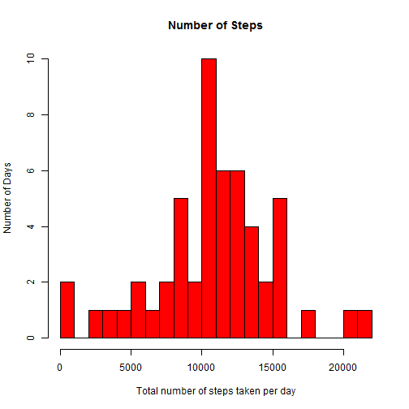
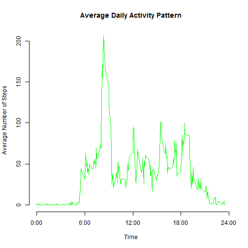
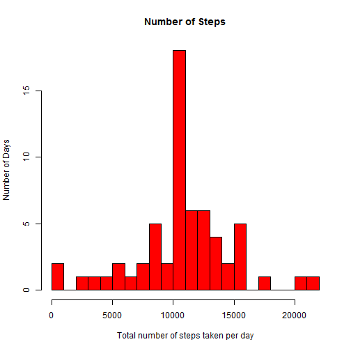
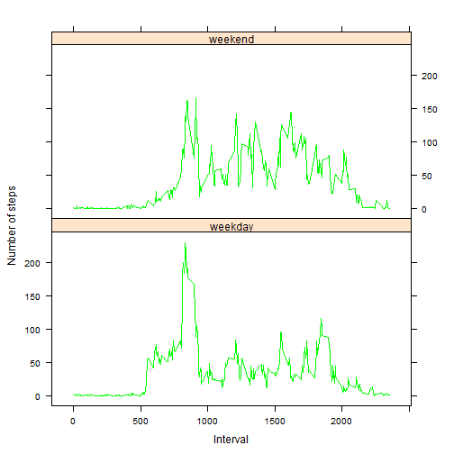

# Reproducible Research: Project1 - Peer Assessment 1

## Steps to execute the program
* Copy the activity.csv file in the working directory.
* Copy the PA1_template.Rmd file in the same directory.
* Open R and set the directory where above files are copied.
* Run below commands to generate the plots and html files.


 *  library("knitr")
 *  library("rmarkdown")
 *  knit2html("PA1_template.Rmd")


Below are the details:

## Loading and preprocessing the data

### Read CSV data

```r
ActivityData <- read.csv("activity.csv", header = T)
```

### Remove NA records

```r
# create a subset. Remove NA records
ActivityDataWithoutNA <- subset(ActivityData,
						is.na(ActivityData$steps) == F)
```

## What is mean total number of steps taken per day?

### Draw the histogram for total step count for each day

Aggregate the information


```r
library(plyr)
totalNoPerDay <- ddply(ActivityDataWithoutNA,
					   .(date),
					   summarise,
					   steps=sum(steps))
```

Plot the information


```r
hist(totalNoPerDay$steps,
     breaks = 20,
     main="Number of Steps",
     col="red",
     xlab="Total number of steps taken per day",
	 ylab="Number of Days")
```

 

### Generate the mean and median of total number of steps taken per day


```r
mean(totalNoPerDay$steps)
```

```
## [1] 10766.19
```

```r
median(totalNoPerDay$steps)
```

```
## [1] 10765
```

## What is the average daily activity pattern?

### Plot the information of the 5-minute interval and the average number of steps taken of all days.

calcluating the average number of steps taken in each 5-minite intervals

```r
averagePerIntv <- ddply(ActivityDataWithoutNA,
						.(interval),
						summarise,
						steps=mean(steps))
```

Generate the plot


```r
plot(averagePerIntv$interval,
     averagePerIntv$steps,
	 main="Average Daily Activity Pattern",
	 axes = F,
	 type="l",
	 col="green",
	 xlab="Time",
	 ylab="Average Number of Steps"
     )
	 
axis(1,
     at=c(0,600,1200,1800,2400),
	 label = c("0:00","6:00","12:00","18:00","24:00")
	)
axis(2)
```

 

### Average across all the days in the dataset, contains the maximum number of steps?


```r
averagePerIntv[which.max(averagePerIntv$steps),]
```

```
##     interval    steps
## 104      835 206.1698
```

## Imputing missing values

### Total number of NA in the dataset

```r
sum(is.na(ActivityData$steps))
```

```
## [1] 2304
```

### Create a new dataset with inclusion of NA fields.


```r
ActData <- ActivityData

for (i in 1:nrow(ActData)){
    if (is.na(ActData$steps[i])){
        ActData$steps[i] <- averagePerIntv$steps[which(ActData$interval[i] == averagePerIntv$interval)]}
}

ActData <- arrange(ActData, interval)
```

### Plot the information

Calculate the total number of steps taken per day


```r
totalNoPerDayActData <- ddply(ActData,
							  .(date),
							  summarise,
							  steps=sum(steps))
```

Generate the plot


```r
hist(totalNoPerDayActData$steps,
     breaks = 20,
	 main="Number of Steps",
	 xlab="Total number of steps taken per day",
	 ylab = "Number of Days", col="red")
```

 

Calculate and report the mean and median total number of steps taken per day on the ActData dataset

```r
mean(totalNoPerDayActData$steps)
```

```
## [1] 10766.19
```


```r
median(totalNoPerDayActData$steps)
```

```
## [1] 10766.19
```

## Are there differences in activity patterns between weekdays and weekends?

### Create a variable in the dataset for weekdays and weekend


```r
ActData$weekdays <- weekdays(as.Date(ActData$date))
ActData$weekdays <- ifelse(ActData$weekdays %in% c("Saturday", "Sunday"),"weekend", "weekday")
```

### Plot the information of the 5-minute interval and the average number of steps taken of all days.

Calculate the avg


```r
average <- ddply(ActData, .(interval, weekdays), summarise, steps=mean(steps))
```

Generate the plot


```r
library(lattice)
xyplot(steps ~ interval | weekdays,
       data = average,
	   layout = c(1, 2),
	   xlab = "Interval",
	   ylab = "Number of steps",
	   col = "green",
	   type="l")
```

 

### End of project assignment

